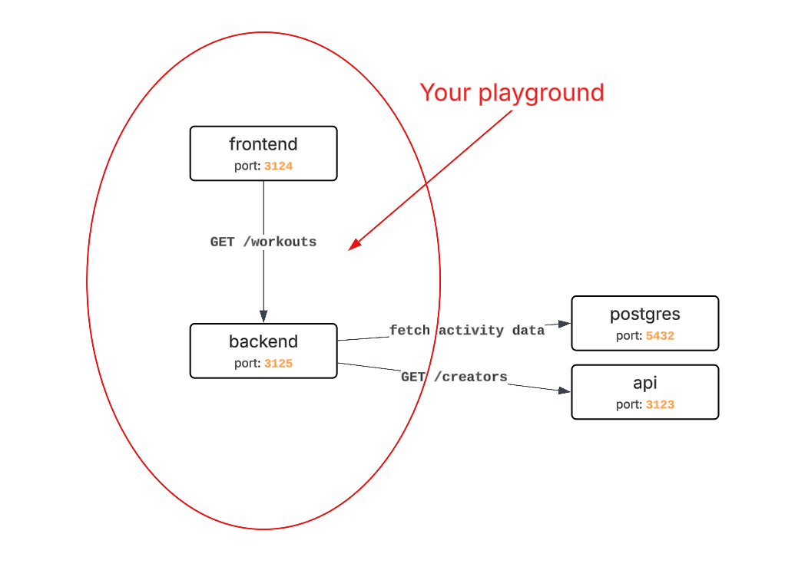
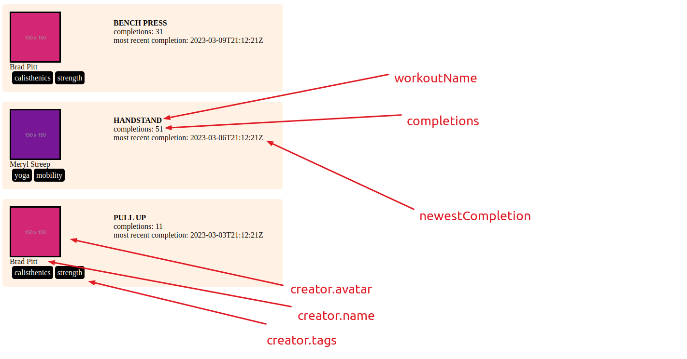

## Description
Your goal is to use the provided dependencies to implement a simple API and a client-side application.
The applications you'll be working with are already up and running in following containers 



### Setup

1. Begin with `docker-compose up -d`
2. Task #1 (Nest.js) app is exposed locally on `localhost:3125`
   - start implementing your solution in `task/backend/src/app.service.ts`
3. Task #2 (React) app is exposed locally on `localhost:3124`
   - start implementing your solution in `task/frontend/src/App.tsx`
4. You can look up the dependencies' data (`postgres` and `api`) at the bottom of this README
---
## Task Walkthrough

### 1. API returning data to your frontend application
   1. expose a single `/workouts` endpoint, returning a list of workouts. It should retrieve necessary data from the pre-built dependencies: the Postgres database and the complimentary microservice (see `#Pre-built dependencies`)
      ```ts
         {
            workoutId: number;
            workoutName: string;
            completions: number;
            newestCompletion: Date;
            creator: { 
               id: number;
               avatar: string;
               name: string;
               tags: string[];
            }
         }
      ```
   2. Order the collection by workouts's most recent completion date, descending (with most recently completed workout at the top)   
   3. **(NTH)** The "tracking function" present in the codebase should be improved so it does not slow down the response, but is still called.
   4. **(NTH)** The endpoint should expect a header `X-Api-Secret` with a value `abc`. If not present, API should return a `403 - Forbidden`

      
### 2. A client-side React application, using the following API to display a list of exercises
   1. Retrieve the data from the API prepared in step 1.
   2. Follow the design presented on the image below. Use flexbox. It does not have to strictly follow the styling - focus on displaying the data.
      
   3. Handle loading and error states
   4. **(NTH)** Implement a toggle, that changes the sorting to display workouts with most completions at the top.


---

## Pre-built dependencies
## `api`
There's an API exposing the port `3123` to the host, with a single endpoint, returning creators' details
```
GET /{creatorId}

Response:
{
    id: number,
    name: string,
    image: string,
    tags: string[]
 }
```

## `postgres`
There's also a Postgres database on the port `5432` with following tables, containing workout completions data
```
workouts
+--+-----------+----------+
|id|name       |creator_id|
+--+-----------+----------+
|1 |bench press|1         |
|2 |squat      |1         |
|          ...            |
+--+-----------+----------+

workout_completion_events
+-------+----------+---------------------------------+
|user_id|workout_id|completed_at                     |
+-------+----------+---------------------------------+
|1      |1         |2023-03-01 12:34:56.000000 +00:00|
|1      |1         |2023-03-02 12:34:56.000000 +00:00|
|                       ...                          |
+-------+----------+---------------------------------+
```
