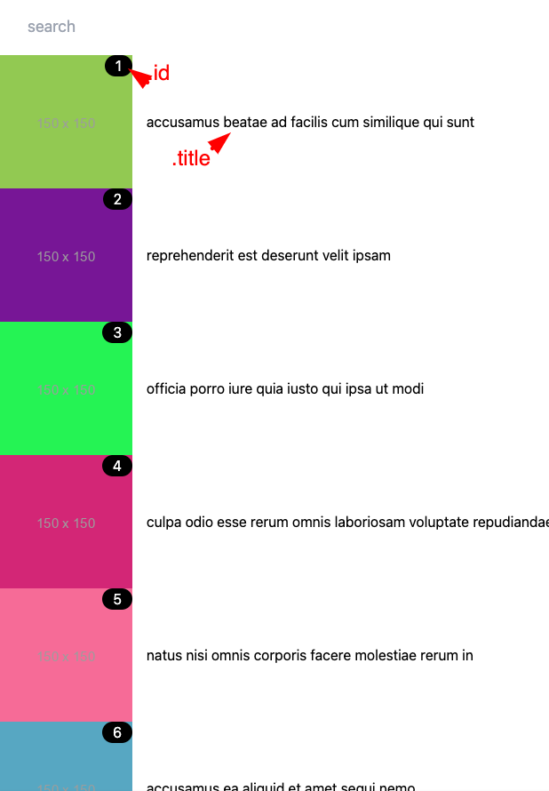

## Description

Using the provided dependencies, please build two services:
1. API returning data to your frontend application
   1. it should expose a single /workouts endpoint returning a sorted list of exercises. Order it by exercise's most recent completion date, descending (with most recently completed workout at the top)
   2. it should retrieve the data from the pre-built dependencies: the Postgres database and the complimentary microservice (see `#Pre-built dependencies`)
   3. it should expect a header `X-Api-Secret` with a value `abc`. If not present, API should return a `403 - Forbidden`
   4. the type returned by the API should be as follows:
      ```ts
         {
            workoutId: number;
            workoutName: string;
            completions: number;
            newestCompletion: Date;
            creator: { 
               id: number;
               name: string;
               tags: string[];
            }
         }
      ```

      
2. A client-side React application, using the following API to display a list of exercises
   1. retrieve the data from the API prepared in step 1.
   2. implement design on image below using flexbox.
      
   3. implement a toggle, that changes the sorting to display workouts with most completions at the top.
   4. please handle loading and error states

## Setup
1. Begin with `docker-compose up -d`
2. Task #1 (Nest.js) app is exposed locally on localhost:3124, implement your solution in `task/backend/src/app.service.ts`
3. Task #2 (React) app is exposed locally on localhost:3125, implement your solution in `task/frontend/src/App.tsx`

## Pre-built dependencies

Please use the following dependencies

1. there's an API exposed on the port `3123` with a single endpoint, returning creators' details
```
GET /{creatorId}

Response:
{
    id: number,
    name: string,
    image: string,
    tags: string[]
 }
```


2. there's also a Postgres database on the port `5543` with following tables, containing workout completions data
```
workouts
+--+-----------+----------+
|id|name       |creator_id|
+--+-----------+----------+
|1 |bench press|1         |
|2 |squat      |1         |
|          ...            |
+--+-----------+----------+

workout_completion_events
+-------+----------+---------------------------------+
|user_id|workout_id|completed_at                     |
+-------+----------+---------------------------------+
|1      |1         |2023-03-01 12:34:56.000000 +00:00|
|1      |1         |2023-03-02 12:34:56.000000 +00:00|
|                       ...                          |
+-------+----------+---------------------------------+
```
